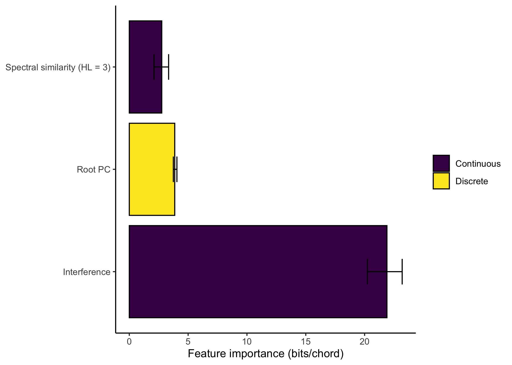

<!-- README.md is generated from README.Rmd. Please edit that file -->

# hvr

<!-- badges: start -->

<!-- badges: end -->

The `hvr` package implements Harrison & Pearce’s harmony viewpoint
regression model. This model generates predictions for chord
progressions on the basis of an assortment of continuous and categorical
perceptual features.

## Installation

From GitHub:

``` r
if (!requireNamespace("devtools")) install.packages("devtools")
devtools::install_github("pmcharrison/hvr")
```

## Example usage

``` r
x <- model_dataset(corpus_test = hcorp::popular_1[1],
                   corpus_pretrain = hcorp::popular_1[2:10],
                   output_dir = "tmp", 
                   viewpoints = hvr_viewpoints[c("root_pc", 
                                                 "hutch_78_roughness",
                                                 "spec_sim_3")],
                   poly_degree = 1)
#> 1/5: Computing viewpoints...
#> Computing training viewpoints...
#> Analysing test sequence 1 out of 1...
#> Computing spectral similarities (half life = 3)...
#> 
#> 2/5: Computing PPM analyses...
#> Computing PPM analyses for fold 1 out of 1...
#>   Pretraining long-term models...
#>   Predicting test sequence 1 out of 1...
#> 
#> 3/5: Constructing model matrix...
#> Getting model matrix for continuous viewpoints...
#> Computing moments...
#> Getting model matrix for discrete viewpoints...
#> Saving outputs...
#> 
#> 4/5: Fitting viewpoint regression model...
#> Loading data...
#>   done.
#> Fitting conditional logit model with optimiser L-BFGS-B...
#> i = 1, cost = 14.5849051613387
#> i = 2, cost = 10.6736467958291
#> i = 3, cost = 7.47732891193488
#> i = 4, cost = 6.21768515070835
#> i = 5, cost = 5.72067609993417
#> i = 6, cost = 5.59570082968013
#> i = 7, cost = 5.60478721301665
#> i = 8, cost = 5.57861243746749
#> i = 9, cost = 5.56841067151148
#> i = 10, cost = 5.56797160957621
#> i = 11, cost = 5.56798982125514
#> i = 12, cost = 5.56796715247232
#> i = 13, cost = 5.56796616667616
#> i = 14, cost = 5.56796616601682
#> Computing permutation feature importances...
#> 
#> 5/5: Generating final predictions...
```

``` r
plot(x$pred$information_content,
     xlab = "Chord position",
     ylab = "Surprisal (bits)",
     type = "l")
```


``` r
ggplot2::theme_set(ggplot2::theme_classic())
plot_perm_int(x$mod, error_bars = TRUE)
```



## Usage notes

### API

The top-level function is `model_dataset`, which automates the standard
modelling pipeline for harmonic viewpoint regression. This function
wraps several lower-level subroutines (e.g. viewpoint computation, PPM
analyses) which can be run individually if desired. See `?model_dataset`
for more details.

### Training set sizes

Optimising feature weights is memory-intensive, and best done with
datasets of \< 1,000 chords. Larger datasets can be modelled using
downsampling. Training categorical viewpoint models is relatively
efficient; the implementation can cope well with datasets of c. 100,000
chords.
